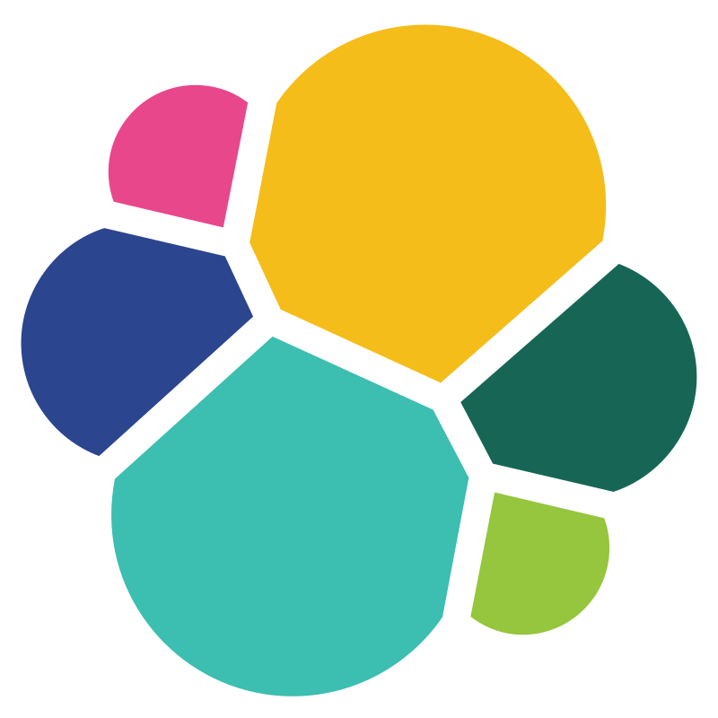

##  Обо мне 
Инженер по ручному тестированию с более чем 9-летним опытом в веб-, десктоп- и API-приложениях

- **Образование**: 

    2003 - окончила [ Байкальский государственный университет](https://bgu.ru/),  экономический факультет, специальность "Финансы и кредит

- **Сертификаты, Аттестации, Курсы повышения квалификации**:
    
    2024 - <a href="http://cert.software-testing.ru/413421443473211978" target="_blank">Автоматизация тестов для REST API при помощи Postman</a>

    2024 - <a href="https://cert.software-testing.ru/412660211414729281" target="_blank">Автоматизация тестирования REST API на Python</a>
    
    2024 - <a href="https://qaschool.ru/school-center/certificate.php?id=24414" target="_blank">Организация автоматизированного тестирования</a>

    2022 - <a href="https://qaschool.ru/school-center/certificate.php?id=23096" target="_blank">Школа тест-менеджеров v. 2.0 </a>

    2019 - <a href="http://scr.istqb.org/" target="_blank">GASQ Service GmbH, ISTQB - Certified Tester Foundation Level Syllabus 2011 Version</a>,  №68749

    2017 - <a href="https://cert.software-testing.ru/nlo/konishchevatatiana.pdf" target="_blank">Техники и инструменты поиска и локализации дефектов</a>
    
    2015 - <a href="https://qaschool.ru/school-center/certificate.php?id=13102" target="_blank"> Школа тест-аналитика</a>

## Используемый стек технологий и инструментов

|                Postman              |                 Swagger             |                  SQL                |                  Elk                |                  Git                |                Allure               |               Confluence          |                  Jira                |                Zephyr               |                 TFS                 |              Charles               |                Python               |       
|:-----------------------------------:|:-----------------------------------:|:-----------------------------------:|:-----------------------------------:|:-----------------------------------:|:-----------------------------------:|:---------------------------------:|:------------------------------------:|:-----------------------------------:|:-----------------------------------:|:----------------------------------:|:-----------------------------------:|
|||||||||||||
